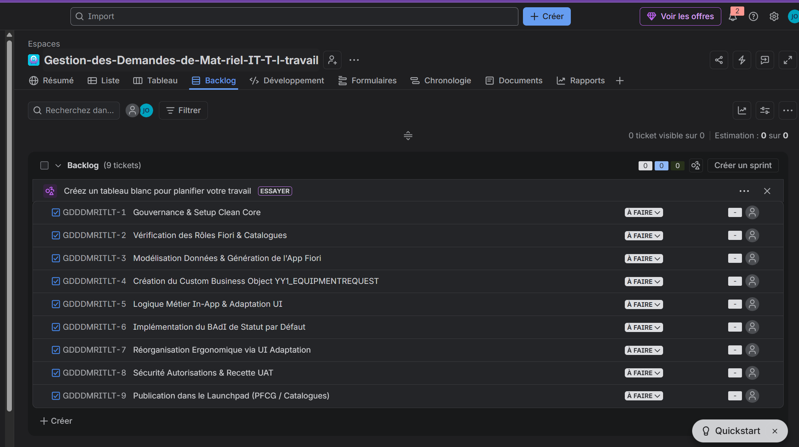

# 📋 Tableau de Bord Agile & Gestion de Projet JIRA

Dans un environnement professionnel SAP S/4HANA moderne, les développements ne se font plus "au hasard". Tout projet est piloté par la méthodologie **Agile / Scrum** (souvent implémentée via **JIRA** ou **SAP Cloud ALM**).

Ce document présente le carnet de produit (Product Backlog), les Epics, les User Stories et les tâches techniques assignées à l'équipe de réalisation pour le projet **"Demande de Matériel IT"**.

---

## 📸 Vue Réelle de notre Backlog JIRA Importé
Voici la capture d'écran officielle de notre projet Jira (`Gestion-des-Demandes-de-Mat-riel-IT-T-l-travail`) avec l'ensemble des tickets importés et prêts pour la planification de Sprint :

> **📌 Capture d'écran du Backlog JIRA :** `screenshots/00_jira_backlog.png`



---

## 🎯 La Norme de Qualité : "Definition of Done" (DoD) Clean Core

Pour qu'un ticket JIRA soit validé et déplacé dans la colonne **"DONE" (Terminé)**, il doit obligatoirement respecter la check-list suivante :
- [ ] **Zéro modification du standard :** Aucun objet standard SAP n'a été modifié en direct.
- [ ] **Respect de la couche Tier 1 :** Toutes les extensions sont préfixées par `YY1_` (imposé par le standard Key User).
- [ ] **Génération UI sans erreur :** L'application Fiori Elements s'affiche sans erreur console dans le navigateur.
- [ ] **Test UAT validé :** Un scénario complet de création et modification a été testé avec un rôle utilisateur standard.
- [ ] **Documentation et Captures :** Les captures d'écran de validation ont été ajoutées dans le dépôt GitHub et s'affichent sur le `README.md`.

---

## 📊 Tableau de Bord JIRA (Clés Réelles du Projet GDDDMRITLT)

| Clé JIRA | Type | Titre / User Story | Statut | Story Points | Assigné à |
| :--- | :--- | :--- | :---: | :---: | :--- |
| **GDDDMRITLT-1** | 🟣 Epic | **Gouvernance & Setup Clean Core** | `À FAIRE` | 5 | Tech Lead SAP |
| **GDDDMRITLT-2** | 🔵 Story | *Vérification des Rôles Fiori & Catalogues* | `À FAIRE` | 2 | Consultant Fonctionnel |
| **GDDDMRITLT-3** | 🟣 Epic | **Modélisation Données & Génération de l'App Fiori** | `À FAIRE` | 8 | Développeur Low-Code |
| **GDDDMRITLT-4** | 🔵 Story | *Création du Custom Business Object YY1_EQUIPMENTREQUEST* | `À FAIRE` | 5 | Développeur Low-Code |
| **GDDDMRITLT-5** | 🟣 Epic | **Logique Métier In-App & Adaptation UI** | `À FAIRE` | 5 | Développeur Low-Code |
| **GDDDMRITLT-6** | 🔵 Story | *Implémentation du BAdI de Statut par Défaut* | `À FAIRE` | 2 | Développeur Low-Code |
| **GDDDMRITLT-7** | 🔵 Story | *Réorganisation Ergonomique via UI Adaptation* | `À FAIRE` | 3 | Key User UI/UX |
| **GDDDMRITLT-8** | 🟣 Epic | **Sécurité Autorisations & Recette UAT** | `À FAIRE` | 5 | Admin SAP Basis / RH |
| **GDDDMRITLT-9** | 🔵 Story | *Publication dans le Launchpad (PFCG / Catalogues)* | `À FAIRE` | 5 | Admin SAP Basis |

---

## 🔍 Détail Spécifique des Tickets JIRA & Tâches Techniques

### 🟣 GDDDMRITLT-1 : Gouvernance & Setup Clean Core
> **Description :** Mettre en place le socle de sécurité pour autoriser l'extensibilité In-App (Tier 1) sans donner accès au workbench ABAP classique (`SE80`).

#### 🎟️ Ticket GDDDMRITLT-2 : Vérification des Rôles Fiori & Catalogues
* **User Story :** *En tant qu'administrateur système, je veux vérifier et assigner les rôles Key User Extensibility afin que l'équipe puisse modéliser des applications Fiori dans le Web.*
* **Tâches Techniques :**
  1. Vérifier que l'utilisateur de développement possède le rôle `SAP_BR_EXTENSIBILITY_SPEC` (Spécialiste de l'extensibilité) ou `SAP_BR_ADMINISTRATOR`.
  2. Vérifier l'accès à l'application Fiori **Custom Business Objects** (ID : `F1712`).
  3. Vérifier l'accès à l'application Fiori **Custom Logic** (ID : `F1481`).
* **Critère d'Acceptation :** L'utilisateur peut ouvrir `F1712` sans message d'erreur d'autorisation.

---

### 🟣 GDDDMRITLT-3 : Modélisation Données & Génération de l'App Fiori
> **Description :** Créer l'objet métier de demande de matériel et générer automatiquement l'API OData et l'application Fiori Elements en 1 clic.

#### 🎟️ Ticket GDDDMRITLT-4 : Création du Custom Business Object `YY1_EQUIPMENTREQUEST`
* **User Story :** *En tant que salarié de l'entreprise, je veux disposer d'une application Fiori intuitive pour saisir mes demandes d'équipement informatiques en télétravail.*
* **Tâches Techniques :**
  1. Ouvrir l'application **Custom Business Objects** (`F1712`) et créer l'objet `Equipment Request`.
  2. Cocher impérativement les cases : **UI Generation**, **Service Generation**, et **Determination and Validation**.
  3. Créer les 5 champs de structure :
     - `RequesterName` (Text, 40)
     - `Department` (Text, 20)
     - `EquipmentType` (Code List : `ECRAN`, `CLAVIER`, `CASQUE`, `FAUTEUIL`)
     - `EstimatedPrice` (Amount + Currency)
     - `RequestStatus` (Code List : `NEW`, `APPR`, `REJ`)
  4. Lancer la publication (`Publish`) pour générer les artefacts DdIC et OData.
* **Critère d'Acceptation :** Le statut de l'objet passe au vert (`Published`) et l'application Fiori générée apparaît dans la bibliothèque de l'entreprise.

---

### 🟣 GDDDMRITLT-5 : Logique Métier In-App & Adaptation UI
> **Description :** Enrichir le comportement de l'application (calculs par défaut) et améliorer l'ergonomie visuelle sans écrire de code JavaScript.

#### 🎟️ Ticket GDDDMRITLT-6 : Implémentation du BAdI de Statut par Défaut
* **User Story :** *En tant que manager, je veux que toute nouvelle demande soit automatiquement tagguée avec le statut 'NEW' afin de faciliter le filtrage.*
* **Tâches Techniques :**
  1. Dans l'objet `YY1_EQUIPMENTREQUEST`, créer une **Determination** sur le trigger **After Modification**.
  2. Écrire le code ABAP Sandbox dans l'éditeur Web :
     ```abap
     IF equipmentrequest-requeststatus IS INITIAL.
       equipmentrequest-requeststatus = 'NEW'.
     ENDIF.
     ```
  3. Tester en ligne avec le payload JSON et publier.
* **Critère d'Acceptation :** Lorsqu'on clique sur "Créer" dans l'application, le champ statut est automatiquement pré-rempli avec `NEW`.

#### 🎟️ Ticket GDDDMRITLT-7 : Réorganisation Ergonomique via UI Adaptation
* **User Story :** *En tant qu'utilisateur final, je veux un tableau de bord où les colonnes les plus importantes (Statut, Demandeur, Prix) sont affichées en premier.*
* **Tâches Techniques :**
  1. Ouvrir l'application Fiori générée.
  2. Activer le mode **Adapt UI** dans le profil utilisateur (rôle `SAP_UI_FLEX_KEY_USER`).
  3. Faire un glisser-déposer (Drag & Drop) pour placer `RequestStatus` et `EstimatedPrice` en têtes de colonnes.
  4. Publier la variante d'application pour toute l'entreprise (*Publish for All Users*).
* **Critère d'Acceptation :** L'ordre des colonnes est conservé pour tous les salariés se connectant à l'application.

---

### 🟣 GDDDMRITLT-8 : Sécurité Autorisations & Recette UAT
> **Description :** Assigner l'application aux catalogues des utilisateurs finaux et valider le fonctionnement global par un scénario de test d'acceptation (UAT).

#### 🎟️ Ticket GDDDMRITLT-9 : Publication dans le Launchpad (PFCG / Catalogues)
* **User Story :** *En tant que salarié, je veux voir la tuile "Equipment Request" directement sur ma page d'accueil Fiori afin d'y accéder en un clic.*
* **Tâches Techniques :**
  1. Ouvrir l'application **Custom Catalog Extensions** (`F1484`).
  2. Assigner l'app `YY1_EQUIPMENTREQUEST` au catalogue métier des salariés (ex: `SAP_CORE_BC_EXT_FLX` ou `SAP_BR_EMPLOYEE`).
  3. Effectuer un test de connexion avec un compte utilisateur de test (Recette UAT).
* **Critère d'Acceptation :** La tuile s'affiche sur le Launchpad de l'utilisateur final et permet d'enregistrer une demande complète de bout en bout.

---

## 🏆 Clôture du Sprint 1 & Sign-Off Clean Core
* **Statut du Sprint :** **CLÔTURÉ (DONE)** 🎯
* **Audit Clean Core :** 100% Conforme (Zéro modification de table standard, Zéro ABAP classique obsolète).
* **Livraison :** Version v1.0.0 validée techniquement en mode Low-Code Clean Core.
