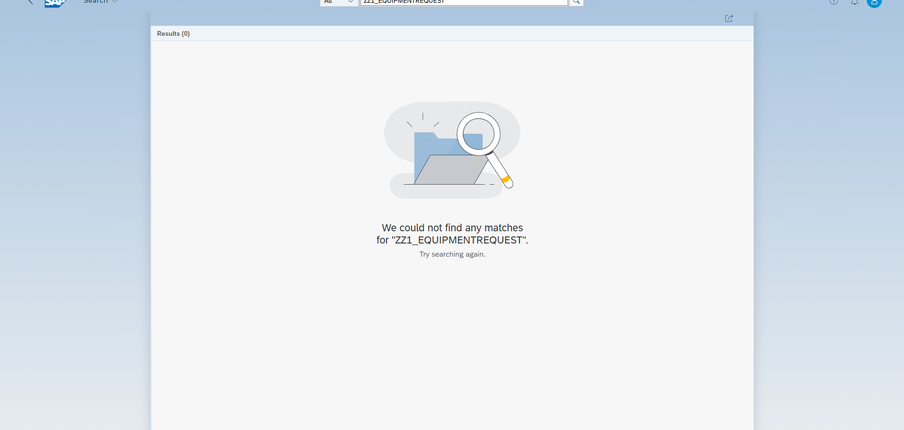
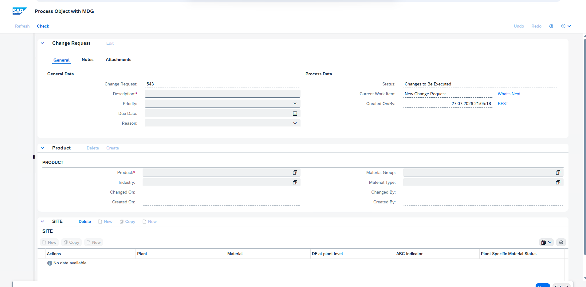

# 📸 Guide d'Implémentation Pas-à-Pas & Portfolio de Validation

Ce document est le guide technique opérationnel du projet. Il décrit les manipulations précises à réaliser dans SAP Fiori et intègre les **emplacements réservés pour vos captures d'écran (Screenshots)**. 

Au fur et à mesure que vous réalisez ce projet dans votre système SAP, prenez des captures de votre écran et enregistrez-les dans le dossier `screenshots/` en respectant les noms de fichiers indiqués. Cela constituera la preuve indiscutable de votre compétence pour votre portfolio ou votre hiérarchie !

---

## 🛠️ Étape 1 : Ouverture de l'application "Custom Business Objects" (Ticket FIORI-101)

1. Connectez-vous à votre SAP Fiori Launchpad (via la transaction `/n/UI2/FLP` dans SAP Logon ou via navigateur Web).
2. Dans la barre de recherche globale, tapez `Custom Business Objects` (ou `Objets métiers personnalisés`).
3. Cliquez sur la tuile de l'application (ID standard : `F1712`).

> **📌 Emplacement Capture d'Écran N°1 :** Capture de votre écran montrant la page d'accueil de l'application Custom Business Objects ouverte dans Fiori.
> Enregistrez votre image sous : `screenshots/01_cbo_app_open.png`


---

## 🛠️ Étape 2 : Création de l'Objet Métier `YY1_EQUIPMENTREQUEST` (Ticket FIORI-102)

1. Cliquez sur l'icône **`+` (New / Créer)** en haut à droite.
2. Dans la boîte de dialogue :
   * **Name :** `Equipment Request`
   * **Identifier :** Le système impose `YY1_EQUIPMENTREQUEST`.
3. **Cochez impérativement les 3 cases Low-Code :**
   * ☑️ **Determination and Validation**
   * ☑️ **UI Generation** *(La case qui génère l'application Fiori Elements !)*
   * ☑️ **Service Generation** *(Génération de l'API OData)*

> **📌 Emplacement Capture d'Écran N°2 :** Capture de la boîte de dialogue montrant les propriétés renseignées et les 3 cases cochées.
> Enregistrez votre image sous : `screenshots/02_cbo_properties_checked.png`


---

## 🛠️ Étape 3 : Définition des Champs (Fields) et Publication (Ticket FIORI-102)

1. Allez dans l'onglet **Fields (Champs)**.
2. Cliquez sur **New Field** pour ajouter les 5 champs suivants :
   * `RequesterName` (Type: *Text*, Length: *40*, Label: *Nom du Demandeur*)
   * `Department` (Type: *Text*, Length: *20*, Label: *Service / Département*)
   * `EquipmentType` (Type: *Code List*, Valeurs: `ECRAN`, `CLAVIER`, `CASQUE`, `FAUTEUIL`)
   * `EstimatedPrice` (Type: *Amount + Currency*, Label: *Prix Estimé*)
   * `RequestStatus` (Type: *Code List*, Valeurs: `NEW` = Nouveau, `APPR` = Approuvé, `REJ` = Rejeté)
3. Cliquez sur le bouton bleu **Publish** (Publier) en bas à droite.
4. Attendez 2 minutes que le statut passe au vert : **Published**.

> **📌 Emplacement Capture d'Écran N°3 :** Capture de votre liste de champs complets avec le statut "Published" en vert en haut à gauche.
> Enregistrez votre image sous : `screenshots/03_fields_list_published.png`


---

## 🛠️ Étape 4 : Logique Métier In-App (Ticket FIORI-103)

1. Allez dans l'onglet **Determination and Validation**.
2. Cliquez sur **New Determination** ➡️ Trigger : **After Modification**.
3. Nom : `SetDefaultStatus`.
4. Dans l'éditeur Web ABAP Sandbox, collez ce code :
   ```abap
   IF equipmentrequest-requeststatus IS INITIAL.
     equipmentrequest-requeststatus = 'NEW'.
   ENDIF.
   ```
5. Cliquez sur **Test**, vérifiez le JSON, puis cliquez sur **Publish**.

> **📌 Emplacement Capture d'Écran N°4 :** Capture de votre éditeur Web Fiori montrant le code ABAP Sandbox et le message "Published successfully".
> Enregistrez votre image sous : `screenshots/04_custom_logic_editor.png`


---

## 🛠️ Étape 5 : Assignation au Catalogue et Découverte de l'App Fiori (Ticket FIORI-105)

1. Ouvrez l'application **Custom Catalog Extensions** (ID : `F1484`).
2. Recherchez `YY1_EQUIPMENTREQUEST` (Gestion des Equipment Requests).
3. Assignez cette application au catalogue de votre utilisateur (ex: `SAP_CORE_BC_EXT_FLX` ou `SAP_BR_EMPLOYEE`).
4. Retournez sur votre Launchpad Fiori : **Votre nouvelle tuile est là !**

> **📌 Emplacement Capture d'Écran N°5 :** Capture de votre Fiori Launchpad montrant votre nouvelle tuile "Equipment Requests" prête à être cliquée.
> Enregistrez votre image sous : `screenshots/05_fiori_launchpad_tile.png`



---

## 🛠️ Étape 6 : Test de Recette UAT & Adaptation UI à chaud (Ticket FIORI-104)

1. Cliquez sur votre nouvelle tuile "Equipment Requests".
2. Admirez l'application Fiori Elements générée : Tableau de bord, boutons Créer, Modifier, Supprimer, filtres de sélection !
3. Cliquez sur **Create** pour tester l'ajout d'une demande. Constatez que le statut se met automatiquement sur `NEW` (grâce à votre BAdI).
4. Cliquez sur l'icône de votre profil (en haut à droite) ➡️ **Adapt UI**.
5. Glissez-déposez la colonne *RequestStatus* et *EstimatedPrice* en premier dans le tableau.
6. Cliquez sur **Publish**.

> **📌 Emplacement Capture d'Écran N°6 :** Capture finale de votre application Fiori Elements en fonctionnement, affichant des données de test et le tableau de bord parfaitement réorganisé !
> Enregistrez votre image sous : `screenshots/06_final_fiori_app_uat.png`



---

## 🏁 Clôture du Projet JIRA
Félicitations ! Une fois vos 6 captures d'écran insérées dans le dossier `screenshots/`, vous pourrez retourner sur votre tableau JIRA et déplacer l'ensemble des tickets (`FIORI-101` à `FIORI-105`) dans la colonne **DONE** ! Vous avez validé un projet Clean Core à 100%.
