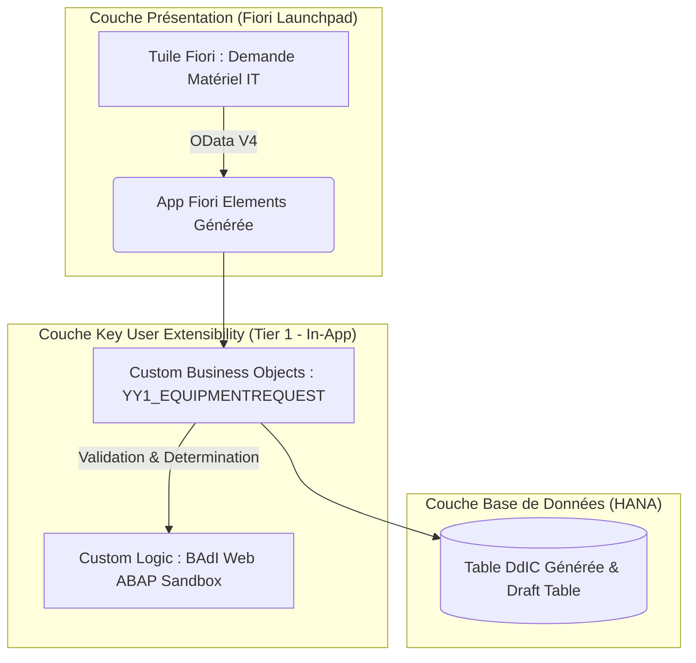

# 🚀 SAP Fiori Elements - Gestion des Demandes de Matériel IT & Télétravail (Low-Code / Key User Extensibility)

[-28A745?style=for-the-badge)](https://help.sap.com)

Bienvenue dans le dépôt officiel du projet **"Gestion des Demandes de Matériel IT & Télétravail"**. 

Ce projet est une implémentation de référence illustrant la création d'une application professionnelle SAP Fiori de bout en bout en mode **"Less Code / Low-Code"** via la couche **Key User Extensibility (Tier 1 - In-App)** d'SAP S/4HANA, dans le respect strict du paradigme **Clean Core**.

---

## 📋 Présentation et Objectifs du Projet

Dans le cadre du passage au travail hybride (Télétravail), le service DSI et RH a besoin d'une application Fiori moderne intégrée au Launchpad permettant aux salariés de demander des équipements informatiques (Écrans 4K, Claviers ergonomiques, Casques audio, Fauteuils) avec un circuit de validation par le manager.

### 🌟 Points Forts Techniques (Pourquoi ce projet est unique) :
* ⚡ **Zéro Code ABAP Lourd :** L'intégralité du modèle de données, du service OData et de l'interface Fiori Elements a été générée automatiquement sans ouvrir Eclipse ADT.
* 🛡️ **100% Clean Core & Upgrade-Safe :** Aucun impact sur le noyau standard SAP. Résistant à 100% aux montées de version annuelles de S/4HANA.
* 🎨 **UI Adaptation :** Personnalisation de l'interface utilisateur à chaud par glisser-déposer.
* 📊 **Gestion Agile sous JIRA :** Projet découpé en Epics, User Stories et Tâches techniques avec des critères d'acceptation (DoD) rigoureux.

---

## 🏗️ Architecture Technique (Modèle 3-Tier)

---

## 📂 Structure de ce Dépôt GitHub

| Fichier / Dossier | Description |
| :--- | :--- |
| **`README.md`** | Le présent document de présentation globale du projet. |
| **`01_JIRA_AGILE_WORKFLOW.md`** | 📋 La gestion de projet complète type **JIRA** (Epics, User Stories, Tasks, Definition of Done). |
| **`02_GUIDE_ET_SCREENSHOTS.md`** | 📸 Guide pas-à-pas d'implémentation dans Fiori avec **emplacements pour les captures d'écran** à chaque étape. |
| **`screenshots/`** | Répertoire destiné à stocker toutes les captures d'écran (preuves de réalisation et tests UAT). |

---

## 🧭 Comment Consulter ce Projet ?

1. Commencez par lire le **[Workflow Agile JIRA (01_JIRA_AGILE_WORKFLOW.md)](01_JIRA_AGILE_WORKFLOW.md)** pour comprendre les exigences métiers et la découpe professionnelle du travail.
2. Suivez ensuite le **[Guide d'Implémentation Pas-à-Pas (02_GUIDE_ET_SCREENSHOTS.md)](02_GUIDE_ET_SCREENSHOTS.md)** pour reproduire ou vérifier les manipulations dans votre système SAP Fiori.
3. Rajoutez vos propres captures dans le dossier `screenshots/` pour alimenter votre portfolio !

---
*Projet réalisé dans le cadre de la maîtrise avancée de SAP Fiori et des bonnes pratiques Clean Core S/4HANA.*
