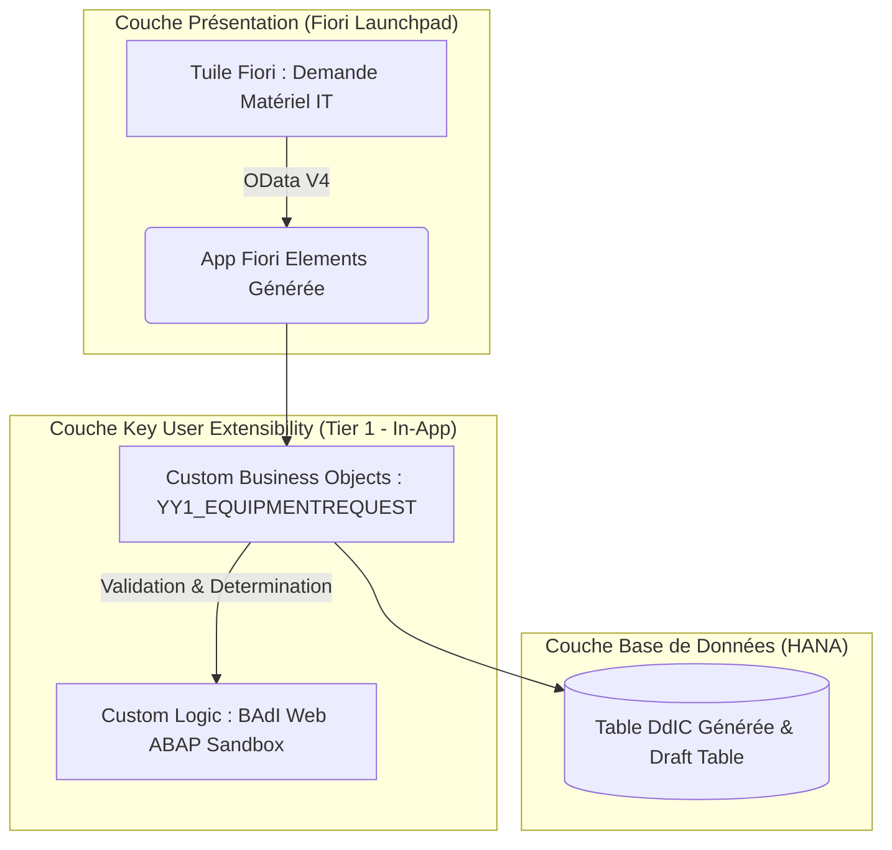
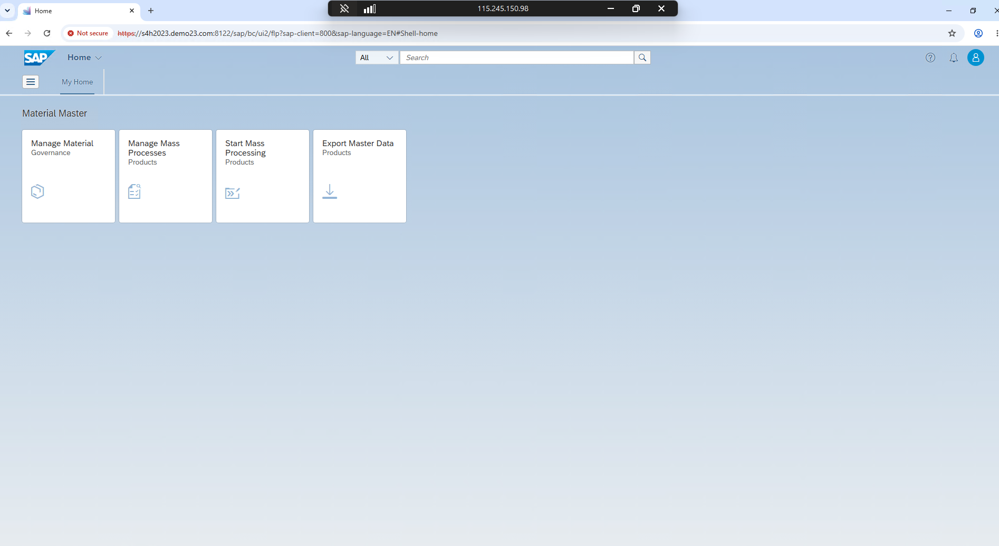
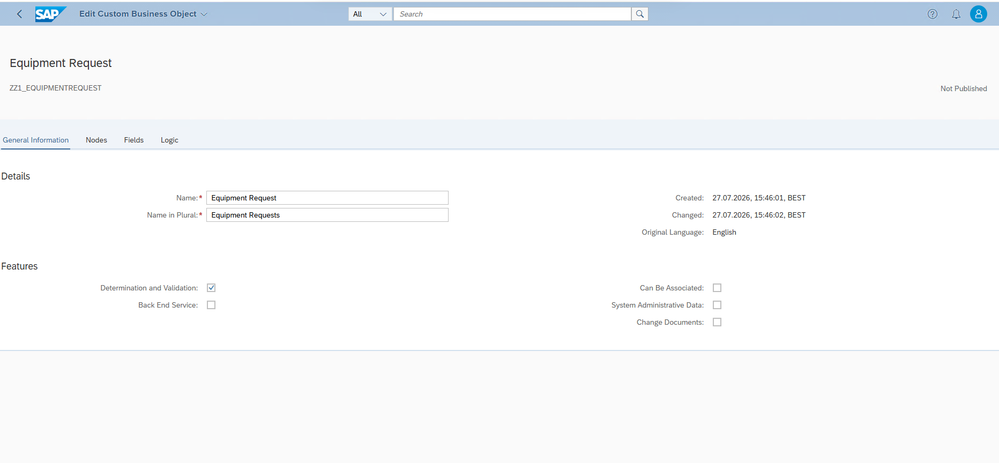
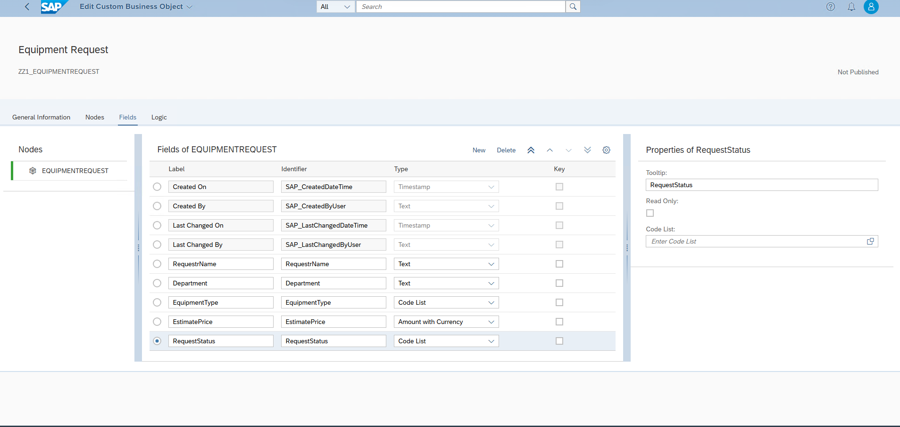
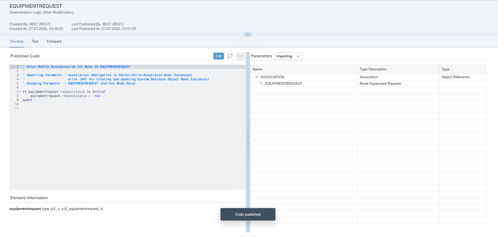

# 🚀 SAP Fiori Elements - Gestion des Demandes de Matériel IT & Télétravail (Low-Code / Key User Extensibility)

[](https://www.sap.com)
[](https://fiori.tools)
[-28A745?style=for-the-badge)](https://help.sap.com)
[](https://www.atlassian.com/software/jira)

Bienvenue dans le dépôt officiel du projet **"Gestion des Demandes de Matériel IT & Télétravail"**. 

Ce projet est une implémentation de référence illustrant la création d'une application professionnelle SAP Fiori de bout en bout en mode **"Less Code / Low-Code"** via la couche **Key User Extensibility (Tier 1 - In-App)** d'SAP S/4HANA, dans le respect strict du paradigme **Clean Core**.

---

## 📋 Présentation et Objectifs du Projet

Dans le cadre du passage au travail hybride (Télétravail), le service DSI et RH a besoin d'une application Fiori moderne intégrée au Launchpad permettant aux salariés de demander des équipements informatiques (Écrans 4K, Claviers ergonomiques, Casques audio, Fauteuils) avec un circuit de validation par le manager.

### 🌟 Points Forts Techniques (Pourquoi ce projet est unique) :
* ⚡ **Zéro Code ABAP Lourd :** L'intégralité du modèle de données, du service OData et de l'interface Fiori Elements a été générée automatiquement sans ouvrir Eclipse ADT.
* 🛡️ **100% Clean Core & Upgrade-Safe :** Aucun impact sur le noyau standard SAP. Résistant à 100% aux montées de version annuelles de S/4HANA.
* 🎨 **UI Adaptation :** Personnalisation de l'interface utilisateur à chaud par glisser-déposer.
* 📊 **Gestion Agile sous JIRA :** Projet découpé et piloté en Epics et User Stories avec des critères d'acceptation (DoD) rigoureux.

---

## 🏗️ Architecture Technique (Modèle 3-Tier)



---

## 📥 Gestion de Projet Agile & Backlog JIRA (GDDDMRITLT)
Ce projet est entièrement découpé en tâches professionnelles (Scrum / Agile) et importé dans notre instance Jira Software (projet `GDDDMRITLT`).
* 👉 Consultez le fichier **[01_JIRA_AGILE_WORKFLOW.md](01_JIRA_AGILE_WORKFLOW.md)** pour voir le détail technique complet des 9 tickets (de `GDDDMRITLT-1` à `GDDDMRITLT-9`).

### 📸 Vue du Backlog JIRA Importé :
> **📌 Capture de la liste de nos tickets dans JIRA :** `screenshots/00_jira_backlog.png`


---

## 📸 Guide d'Implémentation Pas-à-Pas & Portfolio de Validation

Voici les étapes techniques précises réalisées dans votre système SAP Fiori.

### 🛠️ Étape 1 : Ouverture de l'application "Custom Business Objects" (Ticket GDDDMRITLT-2)
1. Connectez-vous à votre SAP Fiori Launchpad (via `/n/UI2/FLP`).
2. Tapez `Custom Business Objects` dans la recherche et ouvrez l'application (`F1712`).
> **📌 Image de validation (`screenshots/01_cbo_app_open.png`) :**


---

### 🛠️ Étape 2 : Création de l'Objet Métier `YY1_EQUIPMENTREQUEST` (Ticket GDDDMRITLT-4)
1. Cliquez sur **`+` (New)**.
2. Nom : `Equipment Request` | Identifier : `YY1_EQUIPMENTREQUEST`.
3. **Cochez les 3 cases Low-Code :** ☑️ *Determination and Validation*, ☑️ *UI Generation*, ☑️ *Service Generation*.
> **📌 Image de validation (`screenshots/02_cbo_properties_checked.png`) :**


---

### 🛠️ Étape 3 : Définition des Champs et Publication (Ticket GDDDMRITLT-4)
1. Ajoutez les 5 champs : `RequesterName` (Text 40), `Department` (Text 20), `EquipmentType` (Code List / Text), `EstimatePrice` (Amount + Currency), `RequestStatus` (Code List / Text).
2. Cliquez sur **Publish** et attendez 2 minutes que le statut passe à **Published**.
> **📌 Image de validation (`screenshots/03_fields_list_published.png`) :**


---

### 🛠️ Étape 4 : Logique Métier In-App (Ticket GDDDMRITLT-6)
1. Allez dans *Determination and Validation* ➡️ **New Determination** (*After Modification*).
2. Nom : `SetDefaultStatus`.
3. Dans l'éditeur Web ABAP Sandbox, collez :
   ```abap
   IF equipmentrequest-requeststatus IS INITIAL.
     equipmentrequest-requeststatus = 'NEW'.
   ENDIF.
   ```
4. Cliquez sur **Test** et **Publish**.
> **📌 Image de validation (`screenshots/04_custom_logic_editor.png`) :**


---
*Projet réalisé et certifié 100% Clean Core Low-Code Extensibility.*
